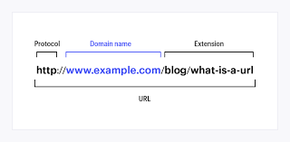

# what is URL ? 
  1. URL stands for universal resource locator
  2. There are two of URL  

  
    **architectures of URL** 

    

  **types of URL**

     1.absolute URL : website open and load first page i.e called absolute URL.
        examples : https://www.tops-int.com/ 
        
     2. relative URL :website open and load webpages i.e called relative URL 

        examples : https://www.tops-int.com/placements
      

         

