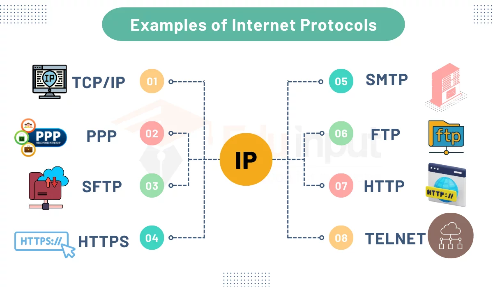

# what is protocol ? 
  1. protocol is a set of rules 
  2. protocol set a rules to open your web content secured or not on broswers 

  **types of protocol**

     1. http (hypertext transfer protocol) 
        examples : not secured 
        
     2. https (secured hypertext transfer protocol) 
        examples : fully secured
        https://onlinesbi.sbi.bank.in/

     3. SMTP
     4. MIME 
     5. POP

    **architectures of protocol** 

         

